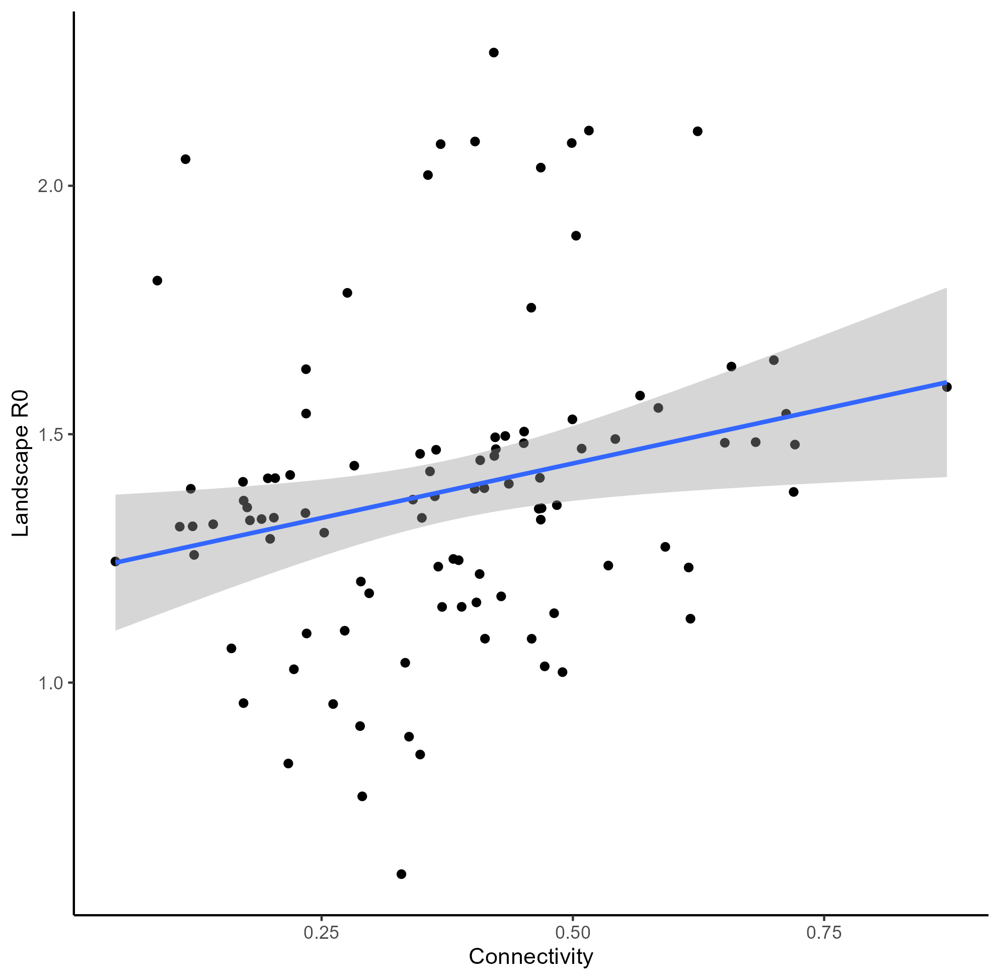
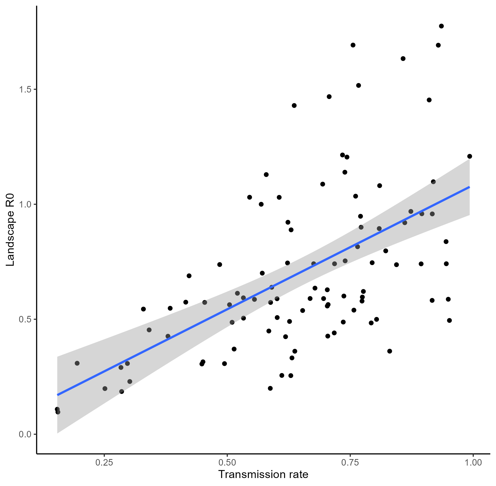
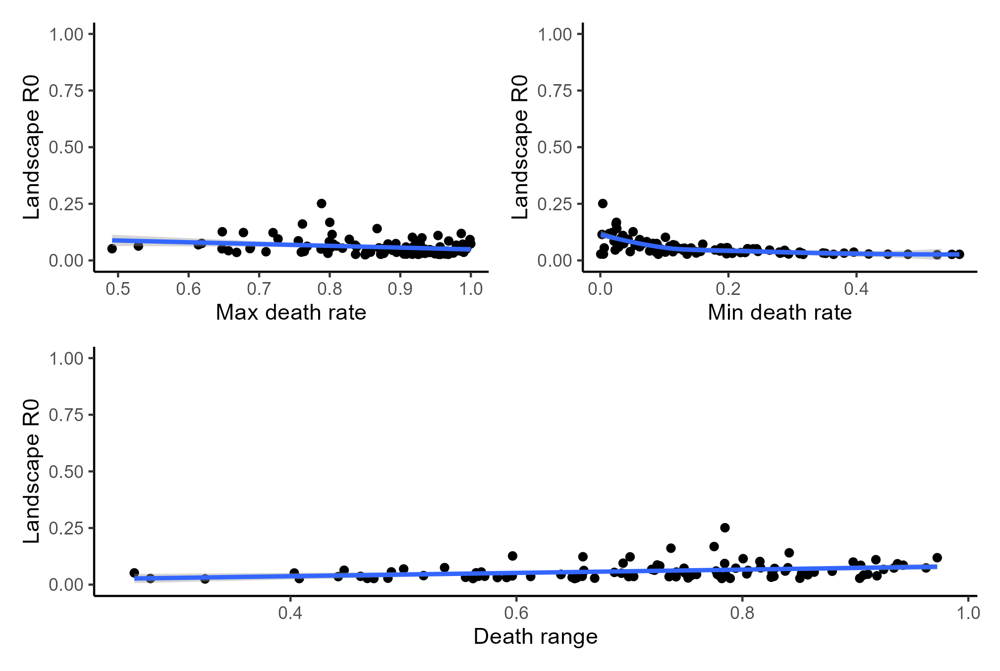
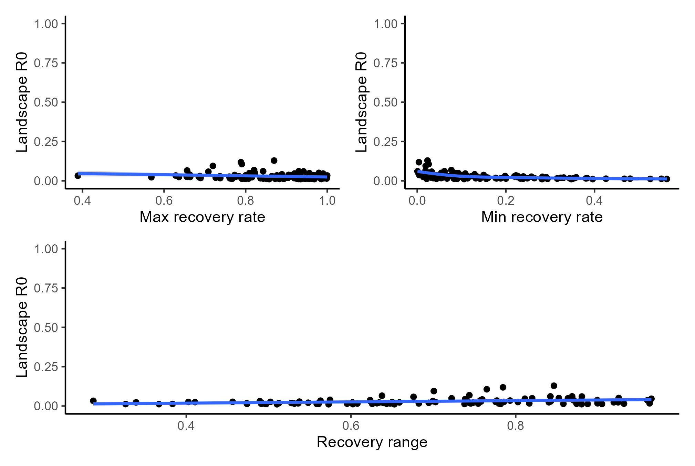
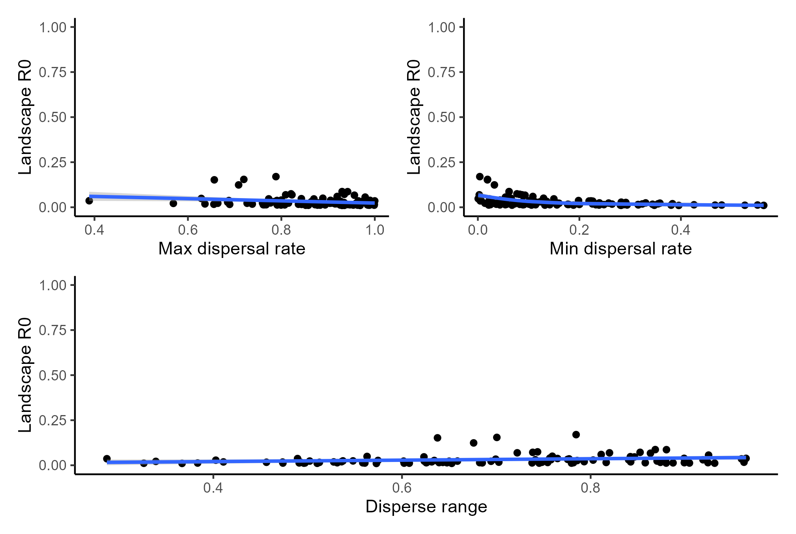

```{r setup, include=FALSE}
knitr::opts_knit$set(root.dir = "D:/gitrepos/MetaDisease/ReportsAndUpdates/02.11.2025")
setwd("D:/gitrepos/MetaDisease/ReportsAndUpdates/02.11.2025")
library(vegan)
library(tidyverse)
library(ggplot2)
library(RColorBrewer)
library(patchwork)
library(betafunctions)
set.seed(1234)
```

# Outline

1. Refresher: What did you ask me to do?
2. Establishing 2 patch metacommunity
3. Running simulations + sensitivity analysis

---

#  Refresher

* When we last met, I presented my structure for running a disease simulation of 100 metacommunities consistiting of 5 patches and up to 6 species
--

* The goal is to understand how a diverse array of communities may affect disease dynamics
--

* The specific hypothesis: as $\beta$ diveristy increase, $R_{0L}$ should decrease.
--

* However, you both cautioned that I may have jumped the gun a little bit with such a complex system
--

* You recommended working with a smaller system (2 patches instead of 5) and assessing the sensitivity of each parameter in the system
--

* I have done as you asked and here I report on how I did it + the initial findings
---

# My asks of you

As we go through this I have two specific things I would like you to keep in mind / question
1. Are there any other sensitivity analysis you would like to see done?
2. Does ny assessment of the outcome of these simulation make sense?
---

# constructing the smaller metacommunity

* First, I set up the parameters to determine number of patches, species, $\psi$, and abundance

```{r Setting Meta-comm params}
#setting up meta-community parameters
set.seed(1234)
num_patches <- 2 #number of patches in metacommunity
num_spp <- 6 #number of POSSIBLE spp in metacommunity

meta_comm1 <- data.frame(matrix(NA, nrow = num_patches, ncol = num_spp))
S <- c(0.83, #PREG
       0.62, #TGRAN
       0.14, #TTOR
       NA, #ABOR
       0.12, #RCAT
       0.64) #RDRAY
S[4] <- runif(n = 1, min = S[5], max = S[3])
#an array of probability values for the occurence of each spp
#what if I over thought this, and I can just assign an occupancy probability?
K <- c(10,6,5,4,3,2)
```

---

# constructing the smaller metacommunity

* Then, we constructed the 100 communities using the same method I showed in our last meeting

```{r build metas}
N <- 100 #number of metacommunity simulations to run
meta_comm_list <- vector("list",N)
beta_list <- vector("list", N)
nestedness_list <- vector("list", N)
for(n in 1:N){
  meta_comm <- data.frame(matrix(NA, nrow = num_patches, ncol = num_spp))
  for(i in 1:nrow(meta_comm)){
    for(j in 1:ncol(meta_comm)){
      #determine occurrence and abundance of spp 1
      meta_comm[i,1] <- rbinom(n = 1, size = 1, prob = S[1])
      meta_comm[i,1] <- ifelse(meta_comm[i,1] == 1, K[1],0)
      
      #determine occurrence and abundance of spp2
      meta_comm[i,2] <- rbinom(n = 1, size = 1, prob = S[2])
      meta_comm[i,2] <- ifelse(meta_comm[i,2] == 1, K[2],0)
      
      #determine occurrence and abundance of spp 3
      meta_comm[i,3] <- rbinom(n = 1, size = 1, prob = S[3])
      meta_comm[i,3] <- ifelse(meta_comm[i,3] == 1, K[3],0)
      
      #determine occurrence and abundance of spp 4
      meta_comm[i,4] <- rbinom(n = 1, size = 1, prob = S[4])
      meta_comm[i,4] <- ifelse(meta_comm[i,4] == 1, K[4],0)
      
      #determine occurrence and abundance of spp 5
      meta_comm[i,5] <- rbinom(n = 1, size = 1, prob = S[5])
      meta_comm[i,5] <- ifelse(meta_comm[i,5] == 1, K[5],0)
      
      #determine occurrence and abundance of spp 6
      meta_comm[i,6] <- rbinom(n = 1, size = 1, prob = S[6])
      meta_comm[i,6] <- ifelse(meta_comm[i,6] == 1, K[6],0)
    }
  }
  meta_comm$Patch <- c('Patch1','Patch2')
  colnames(meta_comm) <- c('Spp1','Spp2','Spp3','spp4','spp5','Spp6','PatchID')
  beta_list[[n]] <- mean(betadiver(meta_comm[,1:6], method = 'w'))
  nestedness_list[[n]] <- nestedtemp(comm = meta_comm[,1:6])[7]
  meta_comm_list[[n]] <- meta_comm
}
```

---

class: center, middle

# Now we have 100 metacommunities
# Next step is to run disease simulations and sensitivity analysis

---

# The Disease Model + Sensitivity
## A brief overview
* As a reminder, there are 6 parameters that influence the disease model we are using. Those are
  - Connectivity
  - Transmission rate ( $\beta$ )
  - Death rate (d)
  - Recovery rate (v)
  - dispersal rate ( $\phi$ )
  - birth rate
--

* We set birth rate = 0 because this is a within season model
--

* The goal of this step is to vary 1 parameter while keeping the other 5 constant, and then check whether it had an effect on $R_{0L}$
--

* I'm going to skip the code on all of this, but essentially for the test for each parameter, I determined that parameters values **within the for{} loop used for simulation. Then I compared the output
* Happy to talk more about this, but I also included a description in the Sensitivity assessment I sent earlier

---

# The Disease Model + Sensitivity
## Connectivity

```{r Connect, echo=FALSE, out.width="65%"}

```

---

# The Disease Model + Sensitivity
## Transmission

```{r Transmission, echo=FALSE, out.width="65%"}

```
---

# The Disease Model + Sensitivity
## Death Rate
```{r Death, echo=FALSE, out.width="75%"}

```

---

# The Disease Model + Sensitivity
## Recovery Rate
```{r Recovery, echo=FALSE, out.width="75%"}

```

---

# The Disease Model + Sensitivity
## Dispersal Rate
```{r Dispersal, echo=FALSE, out.width="75%"}

```
---

# Conclusions

* Connectivity and $\beta$ had relatively strong effects on $R_{OL}$
* d, v, and $\phi$ did not have strong effects on $R_{OL}$

# Next Steps

* What does this mean for the larger model (5 patches)
* Do we want to use the larger model or just focus on this smaller patch?
* Have started working on an outline for the paper to come from this
* What else would you like to see?
